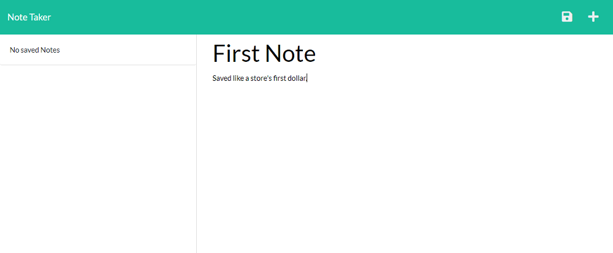
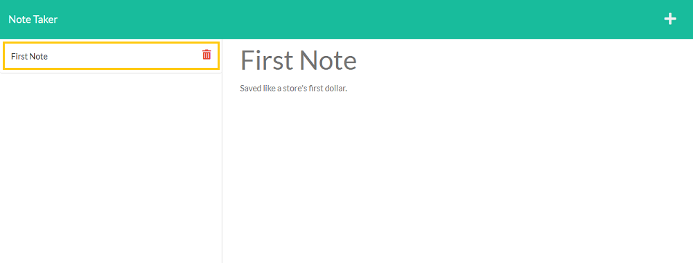

# NOTE TAKER

## Description

This is a deployed Heroku application making use of Express.js to allow a user to write, store, and delete notes on once convenient app.

## Usage

### Navigate to the deployed app here:
[Note Taker](https://note-taker-on-wheels.herokuapp.com/)
### Write notes with title and body text, then click the save icon to save the note to the left column

### Access saved notes by clicking on them in the left column
### Delete any saved notes by clicking on the trash bin icon at the right side of the saved note entry

## Routes

### 

## Questions

Created by: [CWheelsRun](https://github.com/CWheelsRun)
  
If you have any further questions please feel free to contact me at [corey.bennett@live.com](corey.bennett@live.com)